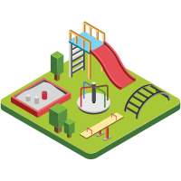

# <b>PlayPI</b>

> A local API testing playground for RESTful, gRPC, GraphQL, and WebSocket APIs.

<!-- Centering and spacing buttons properly -->

[GitHub](https://github.com/abhivaikar/PlayPI)
[Get Started](#playpi)

